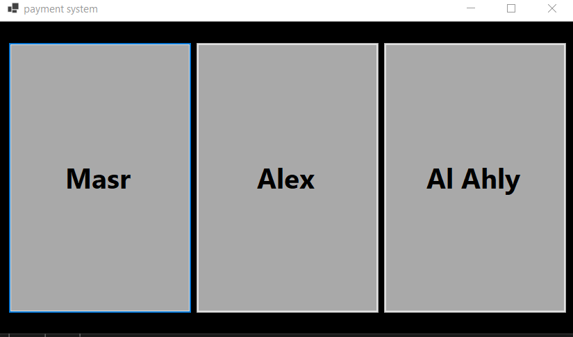

# 💳 Mini Online Payment System

A simple C# console application demonstrating the **Bridge Design Pattern** in the context of an online payment system. This project showcases how to decouple an abstraction from its implementation, allowing both to vary independently.

---

## 🧠 Design Pattern: Bridge

The Bridge pattern is utilized to separate the abstraction (payment types) from their implementations (payment methods). This allows for flexibility and scalability in extending payment types and methods without modifying existing code.

**Structure:**

- **Abstraction:** `Payment`
- **Refined Abstractions:** `OnlinePayment`, `OfflinePayment`
- **Implementor Interface:** `IPaymentMethod`
- **Concrete Implementors:** `CreditCardPayment`, `PayPalPayment`, `CashPayment`

---

## 🚀 Getting Started

1. **Clone the repository:**

   ```bash
   git clone https://github.com/Mekkawy94/Mini-online-Payment-system.git

## 📷 Screenshots




